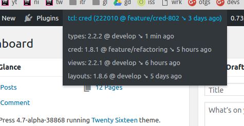
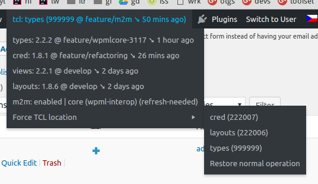

# tcl-status
WordPress plugins that shows information about Toolset plugin versions, branch names and the loaded Toolset Common Library 
instance in the admin bar.

Additionally, if the plugins are in a git repository, the plugin will show how long ago the branch was pulled from the origin.

The first item shows the information about the Toolset Comon library: 

>`tcl: ` *{from what plugin is the library loaded}* `(` *{$toolset_common_version}* `@` *{branch name}* `)`

The `$toolset_common_version` value is displayed only on recent branches where it is accessible from the outside.

Remaining items show active Toolset plugins, their version and branch. 
Following plugins are supported:

- Toolset Types
- Toolset Views
- Toolset CRED
- Toolset Layouts
- Toolset Access

## Installing
 - Clone or download the plugin into the `wp-content/plugins` directory in your site
   - `git clone https://github.com/zaantar/tcl-status.git`
 - Activate the plugin.
   - `wp plugin activate tcl-status`
   
## Additional features

### Extensions

It is possible to add further items by hooking into the `tcl_status_add_nodes` action.

### m2m

The "m2m" item displays the current state of the many-to-many relationship project (at the time when the admin menu is 
rendered, that means [during the `admin_bar_menu` action](https://codex.wordpress.org/Plugin_API/Action_Reference)).

Following tags can be present:

- `enabled`: Many-to-many relationships are enabled.
- `ready`: The support for many-to-many relationships is present but they're not enabled yet.
- `missing`: No support for many-to-many relationships.
- `full`: The m2m controller is fully loaded.
- `core`: Only the m2m controller's core is loaded, saving resources.
- `wpml-interop`: WPML interoperability with m2m associations is active.
- `refresh-needed`: Full refresh of the association translation table is (or will be) needed.

Tags in parentheses mean non-authoritative values (obtained through a workaround) that may not be reliable.

### Forcing an instance of the Toolset Common library

The "Force TCL location" menu item contains a list of detected TCL instances. The user can choose one, which will reload
the page with the selected instance. Internally, the forced TCL path is stored in an option and before TCL is loaded,
the plugin adds it to the `$toolset_common_paths` global variable with a very hight version number (`999999`). 

Because of the way how `$toolset_common_paths` is structured, TCL instances are indexed by versions and the ones with 
the same version will get overwitten. In order to mitigate this, we're adding a list of known paths that will be checked 
and additional entries will be added to the menu with the lowest version numbers possible. Currently, only the Types plugin 
is supported (the plugin base directory must be `types`).

### Plugin updates

tcl-status is compatible with the [github-updater](https://github.com/afragen/github-updater) plugin. If you install 
and activate it, you will recieve updates automatically, like for any other plugin.